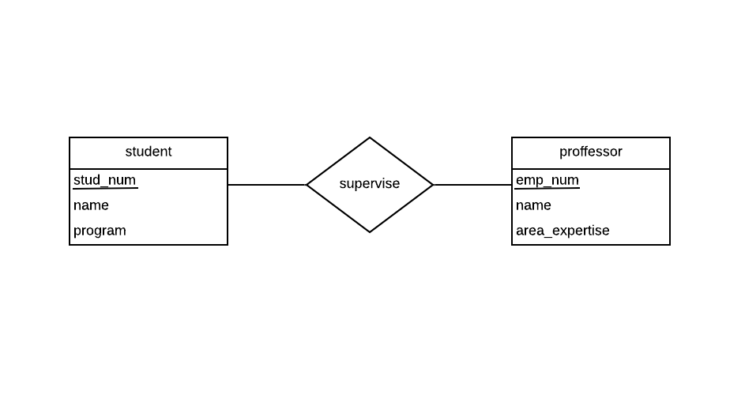
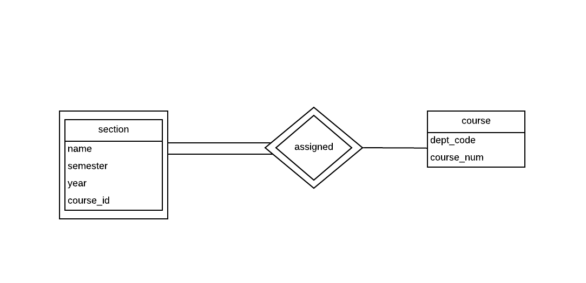
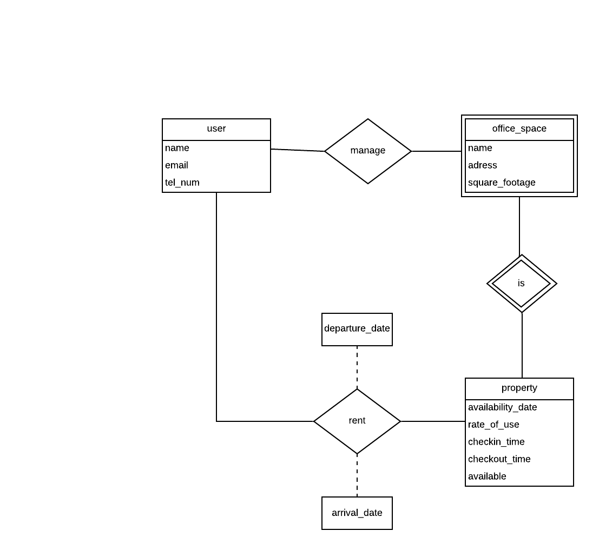
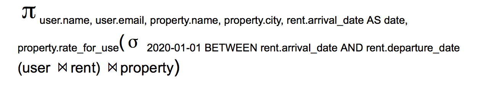

# DEVOIR  1


## PARTIE A

## QUESTION A1

Modèles ER créés avec Lucidchart:

A1_a:


A1_b:


A1_c:


## QUESTION A2

Modèles ER créés avec Lucidchart:

A2:


## QUESTION A3

A3_a:


A3_b:


## PARTIE B

## QUESTION B1

output of B1_a:

| name | experience |
| --- | --- |
|andrew | 2 |
| august | 0 |
| hayden | 1 |

output of B1_b:

| name | release_date|
| --- | --- |
| MS Word | 2011-01-20 |
| Sketch | 2016-06-15 |

output of B1_c:

| ID | name | num |
| --- | --- | --- |
| 49 | hayden | 1 |

## QUESTION B2

Requête sql de B2_a:

```sql
SELECT name
FROM users
WHERE users.join_date < 2020-01-01

```

Requête sql de B2_b:

```sql
SELECT users_id, software_name, Count(*)AS num
FROM  licenses
GROUP BY users_id
ORDER BY (num AND users.name) ASC

```
Requête sql de B2_c:

```sql
INSERT INTO licenses
(users_id,  software_name, access.code)
VALUES
      (51,  MS Word, 'blablebla'),
      (50, Sketch, 'hihahihah');
```

Requête sql de B2_d:

```sql
UPDATE softwares AS S
SET S.version = '51'
WHERE S.name = 'Sketch' AND S.release_date = '2020-01-01'
```
## QUESTION B3

Requête sql de B3_a:

```sql
ALTER TABLE licenses
ADD COLUMN software_version string;
```

Requête sql de B3_a:

```sql
ALTER TABLE softwares
DROP PRIMARY KEY

ALTER TABLE softwares
ADD COLUMN PRIMARY KEY(softwares.name, softwares.version)
