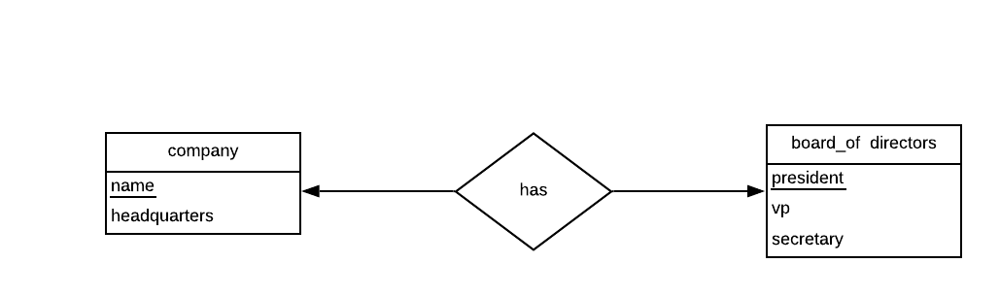
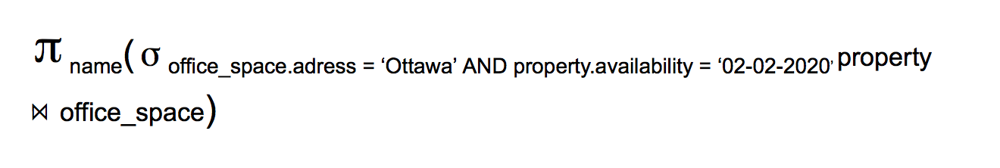

# DEVOIR  1

## PARTIE A

## QUESTION A1

Modèles ER créés avec Lucidchart:

A1_a:

A1_b:

A1_c:

## QUESTION A2

Modèles ER créés avec Lucidchart:

A2:

## QUESTION A3

A3_a:

A3_b:

## PARTIE

## QUESTION B1

| name | experience |
| --- | --- |
|andrew | 2 |
| august | 0 |
| hayden | 1 |

output of B1_b:

| name | release_date|
| --- | --- |
| MS Word | 2011-01-20 |
| Sketch | 2016-06-15 |

output of B1_c:

| ID | name | num |
| --- | --- |
| 49 | hayden | 1 |
